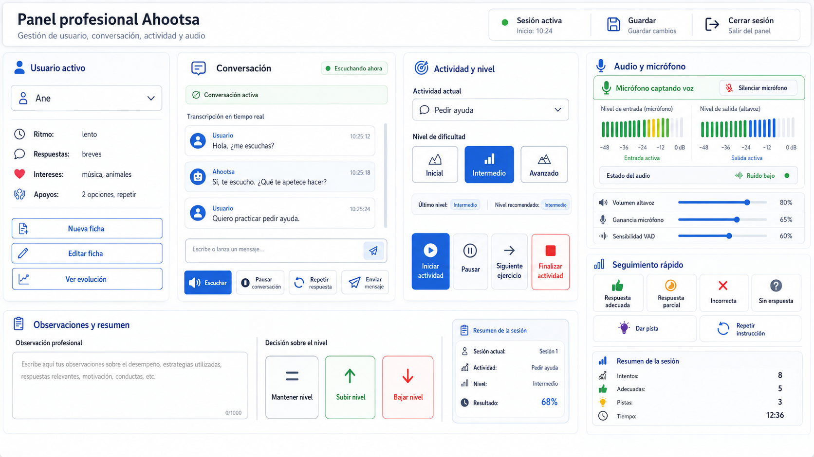

# Ahootsa 8 — Análisis de actividades por niveles y panel profesional

## 1. Finalidad del documento

Este documento analiza una propuesta práctica para incorporar en Ahootsa actividades de comunicación organizadas en tres niveles:

- **Inicial**
- **Intermedio**
- **Avanzado**

La solución se apoya en un **panel profesional HTML** desde el que el monitor o profesional selecciona a la persona usuaria, inicia la actividad, elige el nivel, observa la conversación, controla el audio y registra el progreso.

La idea principal es que Ahootsa acompañe y ejecute la actividad, mientras el profesional mantiene el control sobre las decisiones importantes.

---

## 2. Enfoque general

El sistema debe seguir este flujo:

```text
Seleccionar usuario
→ consultar ficha y progreso
→ elegir actividad
→ elegir nivel
→ iniciar conversación o actividad
→ observar y apoyar
→ registrar resultados
→ finalizar sesión
→ guardar progreso e informe
```

Este enfoque evita que la IA tenga que decidir por sí sola:

- quién está utilizando el robot;
- qué nivel corresponde;
- si una respuesta es adecuada;
- si debe subir o bajar de nivel;
- qué observaciones deben quedar registradas.

La IA puede sugerir, pero la decisión final corresponde al profesional.

---

## 3. Modelo de tres niveles

## 3.1. Nivel inicial

### Características

- frases muy breves;
- una instrucción por turno;
- preguntas cerradas;
- dos opciones como máximo;
- repetición frecuente;
- uso de ejemplos y apoyos;
- refuerzo positivo constante;
- sesiones cortas.

### Objetivos comunicativos

- responder sí o no;
- elegir entre dos opciones;
- nombrar personas, objetos o emociones;
- pedir ayuda mediante una frase modelo;
- expresar una preferencia básica;
- repetir o completar una frase sencilla.

### Papel del profesional

El profesional puede:

- repetir la instrucción;
- ofrecer dos respuestas posibles;
- dar una pista;
- modelar una frase;
- confirmar una respuesta parcial;
- finalizar la actividad cuando aparezca cansancio o bloqueo.

---

## 3.2. Nivel intermedio

### Características

- preguntas abiertas sencillas;
- dos o tres opciones;
- respuestas de varias palabras;
- pequeños intercambios de conversación;
- menos ayudas directas;
- secuencias breves;
- mayor autonomía.

### Objetivos comunicativos

- explicar una preferencia;
- pedir ayuda en una situación cotidiana;
- mantener dos o tres turnos;
- responder y formular una pregunta;
- describir una acción sencilla;
- elegir y justificar brevemente.

### Papel del profesional

El profesional observa:

- comprensión de la consigna;
- autonomía;
- calidad de la respuesta;
- necesidad de pistas;
- capacidad para mantener el turno;
- motivación y tolerancia a la actividad.

---

## 3.3. Nivel avanzado

### Características

- conversación más espontánea;
- respuestas completas;
- role-play;
- narración;
- resolución de situaciones;
- pocos apoyos explícitos;
- varios turnos de conversación.

### Objetivos comunicativos

- iniciar y mantener una conversación;
- explicar un problema;
- pedir información o ayuda;
- contar una experiencia;
- dar una opinión;
- defender una elección;
- resolver una situación social o cotidiana.

### Papel del profesional

El profesional interviene menos, pero conserva la posibilidad de:

- reconducir la conversación;
- añadir una pista;
- cambiar de nivel;
- pausar la actividad;
- registrar observaciones;
- decidir el siguiente objetivo.

---

## 4. El nivel debe guardarse por actividad

No se recomienda asignar a una persona un único nivel general.

El nivel debe ser independiente para cada actividad:

```text
Usuario: Ane
├── Pedir ayuda: Intermedio
├── Expresar preferencias: Avanzado
├── Emociones: Inicial
└── Iniciar conversación: Intermedio
```

Esto permite que la persona avance de forma distinta según la competencia trabajada.

---

## 5. Actividades iniciales recomendadas

## 5.1. Pedir ayuda

### Inicial

- “No puedo abrir esta caja. ¿Qué puedo decir?”
- opciones: “Ayuda” / “No quiero”.

### Intermedio

- “No alcanzas un objeto. ¿Cómo pedirías ayuda?”
- respuesta esperada: una petición funcional breve.

### Avanzado

- role-play en una tienda, aula, pasillo o transporte;
- explicar el problema y pedir ayuda de forma completa.

---

## 5.2. Expresar preferencias

### Inicial

- elegir entre dos elementos;
- música o cuento;
- rojo o azul;
- bailar o conversar.

### Intermedio

- elegir entre tres opciones;
- decir cuál gusta más;
- responder a una pregunta de seguimiento.

### Avanzado

- comparar opciones;
- justificar preferencias;
- conversar sobre intereses habituales.

---

## 5.3. Iniciar y mantener una conversación

### Inicial

- saludar;
- decir el nombre;
- responder a una pregunta simple.

### Intermedio

- saludar y devolver una pregunta;
- mantener dos o tres turnos.

### Avanzado

- conversación funcional;
- cambio de tema;
- expresar acuerdo, duda o interés.

---

## 5.4. Emociones y estados

### Inicial

- reconocer emociones básicas;
- elegir entre contento y triste;
- nombrar un estado.

### Intermedio

- explicar cómo se siente;
- relacionar emoción y situación.

### Avanzado

- hablar de emociones complejas;
- explicar necesidades asociadas;
- comparar estados y situaciones.

---

## 5.5. Contar una experiencia

### Inicial

- completar frases;
- responder a preguntas concretas.

### Intermedio

- contar algo ocurrido recientemente;
- ordenar dos o tres acciones.

### Avanzado

- narración con inicio, desarrollo y cierre;
- responder a preguntas espontáneas.

---

## 6. Papel del profesional durante la sesión

El profesional debe poder registrar rápidamente:

- **Respuesta adecuada**
- **Respuesta parcial**
- **Respuesta incorrecta**
- **Sin respuesta**
- **Dar pista**
- **Repetir instrucción**
- **Dar ejemplo**
- **Siguiente ejercicio**
- **Pausar**
- **Finalizar actividad**

Esto resulta más fiable que una evaluación totalmente automática de la conversación.

---

## 7. Diseño del panel profesional

El panel debe integrar cuatro ámbitos:

1. **Usuario y perfil**
2. **Conversación**
3. **Actividad y nivel**
4. **Audio, micrófono y seguimiento**

## 7.1. Diseño conceptual



### Descripción del diseño

El panel se divide en las siguientes zonas:

### Usuario activo

- selección de la persona;
- ritmo de conversación;
- longitud de respuestas;
- intereses;
- apoyos;
- nueva ficha;
- edición;
- evolución.

### Conversación

- estado de conversación activa;
- indicación “Escuchando ahora”;
- transcripción en tiempo real;
- mensajes de usuario y Ahootsa;
- campo para escribir un mensaje;
- control para escuchar;
- pausar conversación;
- repetir respuesta;
- enviar mensaje.

### Actividad y nivel

- selector de actividad;
- botones Inicial, Intermedio y Avanzado;
- último nivel usado;
- nivel recomendado;
- iniciar actividad;
- pausar;
- siguiente ejercicio;
- finalizar actividad.

### Audio y micrófono

- estado “Micrófono captando voz”;
- indicador de entrada de audio;
- nivel de salida;
- barras de volumen;
- silenciamiento del micrófono;
- volumen del altavoz;
- ganancia del micrófono;
- sensibilidad VAD;
- estado de ruido.

### Seguimiento rápido

- respuesta adecuada;
- respuesta parcial;
- incorrecta;
- sin respuesta;
- dar pista;
- repetir instrucción;
- intentos;
- respuestas adecuadas;
- pistas;
- duración.

### Observaciones y resumen

- observación profesional;
- mantener nivel;
- subir nivel;
- bajar nivel;
- resumen de la sesión;
- resultado final.

---

## 8. Control de conversación y audio

El panel no debe mostrar únicamente la actividad. Debe permitir comprobar si Ahootsa está escuchando correctamente.

## 8.1. Indicadores mínimos

```text
Micrófono activo
Micrófono captando voz
Micrófono silenciado
Nivel de entrada
Nivel de salida
VAD detectando voz
Ruido bajo / medio / alto
```

## 8.2. Controles mínimos

```text
Silenciar micrófono
Activar micrófono
Subir o bajar volumen
Ajustar ganancia
Ajustar sensibilidad VAD
Pausar conversación
Reanudar conversación
Repetir última respuesta
```

## 8.3. Transcripción

La transcripción en tiempo real permite al profesional:

- comprobar qué ha entendido el reconocimiento de voz;
- corregir una mala transcripción;
- detectar errores de idioma;
- saber si el micrófono está funcionando;
- observar el desarrollo de la conversación.

---

## 9. Datos que conviene guardar

## 9.1. Ficha de usuario

- identificador interno;
- nombre preferido;
- idioma;
- ritmo;
- longitud de respuesta;
- número máximo de opciones;
- intereses;
- apoyos;
- refuerzo preferido;
- observaciones profesionales.

## 9.2. Progreso por actividad

- usuario;
- actividad;
- nivel actual;
- último nivel;
- sesiones realizadas;
- respuestas adecuadas;
- respuestas parciales;
- errores;
- ayudas;
- última fecha;
- decisión profesional.

## 9.3. Sesiones

- sesión;
- usuario;
- actividad;
- nivel;
- inicio;
- final;
- duración;
- métricas;
- observación;
- resultado.

No es necesario guardar inicialmente todo el audio ni la transcripción completa. Puede guardarse un resumen estructurado y, cuando sea necesario, eventos concretos.

---

## 10. Base de datos recomendada

La solución más equilibrada para Ahootsa es:

```text
SQLite
+
SQLAlchemy
```

### SQLite

Aporta:

- bajo consumo;
- un único archivo local;
- ausencia de servidor externo;
- suficiente rendimiento para cientos de usuarios y miles de sesiones;
- facilidad de copia de seguridad.

### SQLAlchemy

Aporta:

- modelos de datos claros;
- relaciones entre usuarios, actividades y sesiones;
- menos SQL manual;
- transacciones;
- integración sencilla con FastAPI;
- posibilidad de migrar en el futuro a PostgreSQL.

### Arquitectura

```text
Panel HTML
→ FastAPI
→ SQLAlchemy
→ SQLite
→ data/ahootsa.sqlite
```

### Tablas mínimas

```text
users
user_profiles
activities
activity_levels
user_activity_progress
sessions
session_events
professional_notes
```

---

## 11. Progresión entre niveles

La aplicación puede calcular una recomendación, pero el profesional debe confirmar la decisión.

### Reglas orientativas

```text
Subir nivel
→ buen rendimiento estable
→ pocas ayudas
→ comprensión adecuada

Mantener nivel
→ progreso parcial
→ necesidad moderada de apoyo

Bajar temporalmente
→ bloqueo
→ frustración
→ baja comprensión
→ demasiadas ayudas
```

Ejemplo orientativo:

- subir con aproximadamente un 80 % de respuestas adecuadas en dos sesiones;
- mantener con resultados intermedios;
- reconsiderar el nivel si requiere muchas pistas.

Estas reglas deben ser configurables y nunca presentarse como evaluación clínica.

---

## 12. Flujo completo de una sesión

## Inicio

```text
Profesional entra al panel
→ selecciona usuario
→ revisa la ficha
→ elige actividad
→ confirma nivel
→ comprueba micrófono
→ inicia conversación
```

## Desarrollo

```text
Ahootsa plantea ejercicio
→ usuario responde
→ profesional observa transcripción
→ marca resultado
→ da pista o repite
→ pasa al siguiente ejercicio
```

## Finalización

```text
Profesional finaliza actividad
→ sistema muestra resumen
→ profesional añade observación
→ decide mantener, subir o bajar nivel
→ se guarda sesión y progreso
```

---

## 13. MVP recomendado

La primera versión funcional debería incluir:

1. gestión básica de usuarios;
2. ficha adaptativa;
3. cuatro actividades;
4. tres niveles por actividad;
5. panel HTML profesional;
6. conversación visible;
7. transcripción en tiempo real;
8. control de micrófono y audio;
9. registro rápido de resultados;
10. progreso por usuario y actividad;
11. resumen de sesión;
12. SQLite con SQLAlchemy.

---

## 14. Uso de “Vamos a bailar”

La actividad “Vamos a bailar” puede mantenerse como:

- motivación;
- descanso;
- refuerzo positivo;
- elección personal;
- cierre de sesión.

No debería utilizarse como indicador principal del nivel comunicativo.

---

## 15. Recomendación final

La solución más práctica para Ahootsa consiste en:

```text
Panel profesional local
+
selección manual de usuario
+
actividades JSON con tres niveles
+
conversación y transcripción visibles
+
control de micrófono y audio
+
SQLite y SQLAlchemy
+
seguimiento mediante botones profesionales
+
progreso por usuario y actividad
```

El profesional mantiene el control de la sesión y Ahootsa se encarga de ejecutar la actividad, adaptar la conversación y registrar los datos necesarios.

Este enfoque es sencillo de implantar, consume pocos recursos, reduce errores y permite crecer progresivamente hacia informes, nuevas actividades y mayor personalización.
